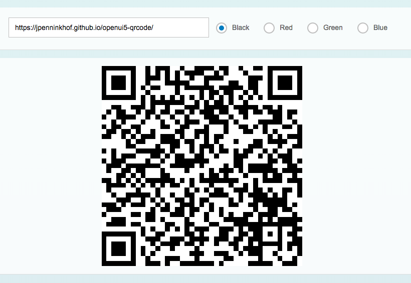

# UI5 QR codes control

This control encodes a arbitrary text into a QR code



## Usage

Step 1. Add the control directory to the application directory (webapp) of your project (don't forget the 3rdparty directory)

Step 2. Register a module path for the custom control in the init method of your `manifest.json` file:

```
    "sap.ui5": {
        ...
        "resourceRoots": {
            "com.penninkhof.controls": "../control"
        }
        ...
    }
```

Step 3. Define the namespace in the top of your view `xmlns:p="com.penninkhof.controls"`, e.g.:

```
    <mvc:View
	    controllerName="com.penninkhof.qrcode.controller.Main"
	    xmlns:html="http://www.w3.org/1999/xhtml"
	    xmlns:mvc="sap.ui.core.mvc"
	    xmlns:p="com.penninkhof.controls"
	    xmlns="sap.m">
```

Step 4. And just add: `<p:QRCode code="Awesome code" />` to your view. Of course you could also bind the code to a model: `<p:QRCode code="{/code}" />`

## Example

You can use this link to see the custom control in action: https://jpenninkhof.github.io/openui5-qrcode/
